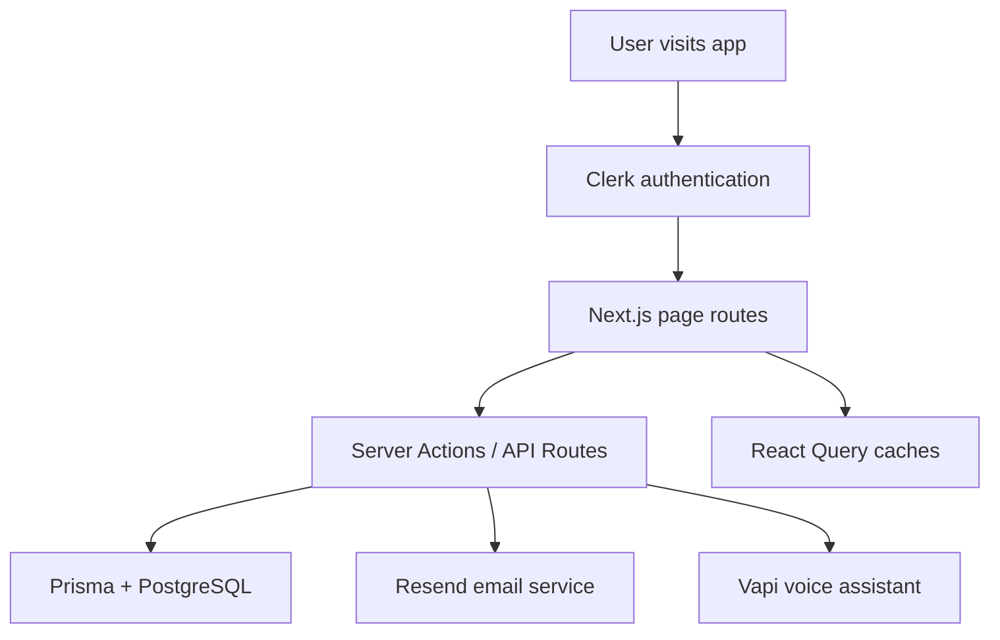

# DentWise Project Explanation

## 1. What this project is

DentWise is a modern full-stack dental care platform built with Next.js and TypeScript. It combines several product experiences into one app:

- a polished landing page for marketing and user acquisition
- secure authentication with Clerk
- a user dashboard for logged-in patients
- an appointment booking system for dental visits
- an admin dashboard for managing doctors and appointments
- an AI voice assistant experience powered by Vapi for dental guidance
- automated email confirmations through Resend
- PostgreSQL-backed persistence with Prisma ORM

In simple terms, this app acts like a dental health platform that helps users:

1. learn about the service through a landing page
2. sign up or log in
3. access a personalized dashboard
4. book appointments with dentists
5. receive booking confirmation emails
6. optionally use an AI voice assistant for guidance
7. let admins manage doctors and appointments

---

## 2. High-level architecture

This project follows a modern Next.js App Router architecture:

- Frontend: React + Next.js App Router + TypeScript
- Styling: Tailwind CSS + shadcn/ui component system
- Authentication: Clerk
- Backend logic: Server Actions in Next.js
- Database: Prisma ORM connected to PostgreSQL
- Data fetching: TanStack Query (React Query)
- Email: Resend + React Email templates
- Voice AI: Vapi AI Web SDK
- Notifications: Sonner toast notifications

### Architecture flow

---

## 3. Main technologies and why they are used

### Next.js 15
Used for the main application framework.

Why it is used:
- route-based app structure
- server components and client components
- server actions for database and auth logic
- fast page rendering and route organization

### React 19
Used for building the UI and component-based interface.

Why it is used:
- reusable component structure
- state management for multi-step flows
- modern hooks and component model

### TypeScript
Used throughout the project for type safety.

Why it is used:
- safer props and state management
- cleaner development experience
- reduces runtime bugs in forms and actions

### Tailwind CSS
Used for design and layout styling.

Why it is used:
- utility-first responsive styling
- fast UI iteration
- paired well with shadcn UI components

### shadcn/ui
Used as the UI component foundation.

Why it is used:
- accessible UI primitives like dialogs, cards, buttons, tables, accordions, etc.
- consistent design system
- reduces time spent building basic components

### Clerk
Used for authentication, user identity, and plan-based access control.

Features implemented through Clerk:
- login/signup flows
- user session handling
- user profile info like first name, last name, email, image
- protected routes through middleware
- plan gating for the voice assistant
- pricing table integration on the Pro page

### Prisma ORM
Used as the database layer.

Why it is used:
- strongly typed database access
- clean schema definitions for models and enums
- easier CRUD operations than raw SQL

### PostgreSQL
Used as the relational database engine.

Why it is used:
- stores users, doctors, and appointments
- reliable relational structure for relationships between models

### TanStack Query
Used for managing server state on the client.

Why it is used:
- fetching doctor data and appointment data efficiently
- automatic caching and invalidation
- better UX when data changes after booking or editing

### Resend
Used to send email confirmations.

Why it is used:
- simple transactional email infrastructure
- integrates well with Next.js server routes
- used for appointment confirmation emails

### Vapi
Used for the AI voice assistant experience.

Why it is used:
- voice-based AI calling experience
- starts and controls a voice interaction from the web UI
- connects to an AI assistant configured through Vapi

### Sonner
Used to show toast notifications.

Why it is used:
- lightweight success/error feedback in booking flows

### date-fns
Used for formatting and comparing dates.

Why it is used:
- human-readable date formatting in dashboard and appointment views

### lucide-react
Used for icons across the app.

Why it is used:
- clean modern icon set
- consistent iconography in cards, nav, dashboards, and call UI

---

## 4. Main functions and logic used in the project

This section explains the core functions and business logic that power the app.

### 4.1 User synchronization logic
File: src/lib/actions/users.ts

Main function: syncUser()

What it does:
- checks the currently authenticated Clerk user
- looks for an existing Prisma user record using clerkId
- creates a new user in the database if the user does not exist yet
- ensures the app has a local user record for appointments and dashboard features

Why it matters:
- it connects authentication with the database
- allows the app to store profile data and link appointments to a real user record

### 4.2 Appointment fetching and transformation logic
File: src/lib/actions/appointments.ts

Main functions:
- getAppointments()
- getUserAppointments()
- getUserAppointmentStats()
- getBookedTimeSlots()
- bookAppointment()
- updateAppointmentStatus()

Key logic:
- getAppointments() fetches all appointments for the admin side and includes related user/doctor data
- getUserAppointments() fetches only the appointments belonging to the signed-in user
- getUserAppointmentStats() returns counts such as total appointments and completed visits
- getBookedTimeSlots() queries appointments for a specific doctor and date to prevent double-booking
- bookAppointment() creates a new appointment tied to the authenticated user and selected doctor
- updateAppointmentStatus() changes an appointment from CONFIRMED to COMPLETED or vice versa

Important behavior:
- many of these functions use Prisma relations to include doctor and user information directly in the result
- the data is transformed into a frontend-friendly shape that includes patientName, patientEmail, doctorName, and doctorImageUrl

### 4.3 Doctor management logic
File: src/lib/actions/doctors.ts

Main functions:
- getDoctors()
- createDoctor()
- updateDoctor()
- getAvailableDoctors()

Key logic:
- getDoctors() retrieves all doctors and includes appointment counts
- createDoctor() validates required data, creates a doctor record, and generates an avatar image URL using the name and gender
- updateDoctor() validates input and ensures the new email does not conflict with an existing doctor
- getAvailableDoctors() returns only active doctors for the booking experience

Why it matters:
- this logic powers the admin doctor management experience and the dentist selection flow

### 4.4 Booking workflow logic
File: src/app/appointments/page.tsx

Main logic flow:
- the page keeps state for selectedDentistId, selectedDate, selectedTime, selectedType, currentStep, and confirmation visibility
- the user moves through a multi-step booking flow
- when the booking form is submitted, the app calls the booking mutation
- on success, it stores the appointment details, sends a confirmation email, and displays the success modal

Key behavior:
- the flow is split into clear UI steps for usability
- the app resets the form after successful booking
- the user can see their upcoming appointments immediately after booking

### 4.5 Availability and time-slot logic
Files:
- src/hooks/use-appointment.ts
- src/components/appointments/TimeSelectionStep.tsx
- src/lib/utils.ts

Logic:
- getNext5Days() generates the next five selectable dates
- getAvailableTimeSlots() provides a list of supported time values such as 09:00, 10:00, and 14:30
- getBookedTimeSlots() checks the existing appointments for a doctor and date
- the UI disables already-booked time slots so the user cannot select them

Why it matters:
- this prevents overlapping appointments and improves booking reliability

### 4.6 Email sending logic
File: src/app/api/send-appointment-email/route.ts

Main logic:
- accepts appointment details from the frontend
- validates required fields such as email, doctor name, date, and time
- sends the email using Resend
- returns a success or error response to the frontend

Why it matters:
- this powers the confirmation email experience after booking

### 4.7 Voice assistant logic
Files:
- src/components/voice/VapiWidget.tsx
- src/lib/vapi.ts
- src/lib/vapi-prompt.ts

Main logic:
- the component initializes a Vapi client and listens for call lifecycle events such as call start, call end, speech start, speech end, and incoming messages
- the UI toggles between connecting, active call, and ended call states
- the assistant uses a custom prompt and persona defined in vapi-prompt.ts
- the page checks whether the user has the proper plan before allowing access

Why it matters:
- this creates the AI voice experience for users who have access to premium features

### 4.8 Dashboard and summary logic
Files:
- src/components/dashboard/NextAppointment.tsx
- src/components/dashboard/DentalHealthOverview.tsx

Main logic:
- NextAppointment() filters appointments to show only upcoming confirmed visits
- DentalHealthOverview() displays appointment statistics like completed visits and total visits
- the dashboard combines server data with Clerk user information to create a personalized view

Why it matters:
- this makes the app feel like a real user-facing health dashboard rather than a static booking form

### 4.9 Admin management logic
Files:
- src/components/admin/DoctorsManagement.tsx
- src/components/admin/RecentAppointments.tsx

Main logic:
- the admin can add doctors through a dialog and edit existing doctors through another dialog
- the recent appointments table shows appointment records and allows status toggling
- the logic is driven by React Query hooks so the UI updates automatically after changes

Why it matters:
- this gives the app a real operational layer for practice management

### 4.10 UI state and component interaction logic
Files:
- src/components/appointments/BookingConfirmationStep.tsx
- src/components/appointments/DoctorSelectionStep.tsx
- src/components/appointments/TimeSelectionStep.tsx

Main logic:
- the booking UI passes state upward from child components to the main appointments page
- selected doctor, date, time, and appointment type determine what the user sees next
- component state is reset after successful booking to keep the flow clean

Why it matters:
- this makes the booking experience modular and easier to maintain

---

## 5. Project folder structure and what each part does

## Root files

### package.json
Contains all project dependencies and scripts.

Important scripts:
- dev: start the Next.js development server
- build: run Prisma generate and build the app
- lint: run Biome lint checks
- format: format files with Biome

### tsconfig.json
Configures TypeScript compiler options and path aliases such as @/*.

### next.config.ts
Configures Next.js settings and image remote hosts.

### components.json
Configures shadcn/ui component generation and path aliases.

### biome.json
Project formatting and linting config.

### prisma/schema.prisma
Defines the database schema for users, doctors, appointments, and enums.

### README.md
Contains the basic project overview and setup instructions.

---

## 5. Main source folder: src

## src/app
This folder contains the Next.js App Router pages and API routes.

### src/app/page.tsx
The home page of the app.

Responsibilities:
- shows the landing page experience
- calls syncUser() to create or sync a Clerk user in the database
- redirects authenticated users to /dashboard
- renders the main marketing sections: Hero, How It Works, Pricing, CTA, Footer

### src/app/layout.tsx
The root layout for the whole application.

Responsibilities:
- adds global fonts
- includes ClerkProvider for authentication context
- includes TanStackProvider for React Query context
- includes Toaster for notifications
- adds global CSS

### src/app/globals.css
Global CSS file.

Responsibilities:
- base styles and theme variables
- Tailwind setup
- design tokens for the app

### src/app/dashboard/page.tsx
The dashboard route for logged-in users.

Responsibilities:
- renders the dashboard experience with navbar and dashboard widgets
- composes the welcome section, main actions, and activity overview

### src/app/appointments/page.tsx
The main appointment booking experience.

Responsibilities:
- manages the 3-step booking flow
- tracks selected doctor, date, time, and appointment type
- calls the booking mutation
- sends confirmation email after a successful booking
- shows a confirmation modal
- displays the user’s existing appointments

### src/app/admin/page.tsx
The admin route entry point.

Responsibilities:
- acts as the server-side wrapper for the admin dashboard
- loads the admin UI client component

### src/app/admin/AdminDashboardClient.tsx
The actual admin dashboard UI component.

Responsibilities:
- fetches doctor and appointment data
- calculates admin statistics
- renders cards and widgets for admin management
- includes doctors management and recent appointments sections

### src/app/pro/page.tsx
The Pro/upgrade page.

Responsibilities:
- shows pricing and plan options via Clerk’s PricingTable
- redirects unauthenticated users to the homepage
- provides access to premium AI features

### src/app/voice/page.tsx
The voice assistant page.

Responsibilities:
- checks whether the current user has a qualifying subscription/plan
- shows a gated experience if the user does not have access
- renders the voice UI if access is available

### src/app/api/send-appointment-email/route.ts
An API route for sending appointment confirmation emails.

Responsibilities:
- accepts appointment details from the frontend
- validates required fields
- sends an email via Resend
- returns success or failure status

---

## 6. Components folder: src/components

This folder contains reusable and page-specific UI components.

## src/components/Navbar.tsx
The top navigation bar used across many pages.

Responsibilities:
- shows links to dashboard, appointments, voice, and pro pages
- displays the logged-in user details and Clerk UserButton
- helps users navigate the app consistently

## src/components/UserSync.tsx
A small client component used to sync the Clerk user with the Prisma database.

Responsibilities:
- detects whether the user is signed in
- calls syncUser() when the authentication state is ready
- ensures the database has a matching user record

## Landing page components: src/components/landing
These components build the public marketing experience.

### Header.tsx
The top header shown on the landing page.

Responsibilities:
- logo and branding
- login/sign-up buttons
- navigation links

### Hero.tsx
The hero section of the website.

Responsibilities:
- strong headline and call-to-action buttons
- visual imagery and social proof styling
- promotes AI dental assistance and appointment booking

### HowItWorks.tsx
Explains the product in three simple steps.

Responsibilities:
- shows the user journey from asking questions to booking care

### WhatToAsk.tsx
Shows examples of common dental questions the AI can help answer.

Responsibilities:
- marketing-focused explanation of the value of the AI assistant

### PricingSection.tsx
Shows the pricing tiers.

Responsibilities:
- free plan, AI Basic, and AI Pro
- encourages users to upgrade for voice AI capabilities

### CTA.tsx
Calls users to action near the bottom of the landing page.

Responsibilities:
- makes the conversion path obvious
- directs users toward sign-up or booking

### Footer.tsx
The site footer.

Responsibilities:
- brand info and simple links

## Dashboard components: src/components/dashboard
### WelcomeSection.tsx
Shows a personalized greeting for the authenticated user.

Responsibilities:
- uses Clerk currentUser() server data
- displays a friendly welcome card with branding

### MainActions.tsx
The main action cards on the dashboard.

Responsibilities:
- links to the AI voice assistant and booking flow
- encourages users to continue using the product

### ActivityOverview.tsx
A wrapper component for the dashboard activity widgets.

Responsibilities:
- organizes the overall dashboard content layout

### DentalHealthOverview.tsx
Shows the user’s dental care summary.

Responsibilities:
- uses appointment stats from the server
- displays completed visits, total appointments, and membership date
- links to booking and AI assistant features

### NextAppointment.tsx
Shows the next upcoming appointment.

Responsibilities:
- queries the user’s appointments
- filters for upcoming confirmed appointments
- displays the date, time, doctor, and reason

### NoNextAppointments.tsx
A fallback widget shown when the user has no upcoming appointments.

Responsibilities:
- provides empty-state experience

## Appointment booking components: src/components/appointments
### DoctorSelectionStep.tsx
The first step in the booking flow.

Responsibilities:
- lists available doctors
- lets the user select a dentist
- shows doctor cards with image, speciality, phone, and appointment count

### TimeSelectionStep.tsx
The second step in the booking flow.

Responsibilities:
- lets the user choose date, time, and appointment type
- uses available time slots and booked slots logic
- disables already-booked time slots

### BookingConfirmationStep.tsx
The third step in the booking flow.

Responsibilities:
- summarizes the selected doctor, date, time, and appointment type
- lets the user confirm their booking

### DoctorInfo.tsx
A lightweight helper that displays selected doctor information.

Responsibilities:
- fetches the selected doctor and shows a compact summary

### AppointmentConfirmationModal.tsx
A confirmation dialog shown after successful booking.

Responsibilities:
- displays a success state
- confirms that details were sent to the user’s inbox
- gives the user options to view appointments or close the modal

### ProgressSteps.tsx
A visual progress indicator for the booking flow.

Responsibilities:
- shows the user which stage they are currently on

### DoctorCardsLoading.tsx
A loading skeleton for doctor selection cards.

Responsibilities:
- improves UX while doctor data is loading

## Admin components: src/components/admin
### AddDoctorDialog.tsx
Dialog for creating a new doctor.

Responsibilities:
- collects doctor details
- submits doctor data to the server action
- handles create flow

### EditDoctorDialog.tsx
Dialog for editing a doctor’s information.

Responsibilities:
- loads existing doctor values
- updates doctor information through the server action

### DoctorsManagement.tsx
The main admin doctor management interface.

Responsibilities:
- displays all doctors in a card list
- allows adding and editing doctors
- shows doctor status, contact info, and appointment count

### AdminStats.tsx
Displays summary statistics for the admin panel.

Responsibilities:
- shows counts for doctors, active doctors, appointments, and completed appointments

### RecentAppointments.tsx
Shows the appointment list in a table.

Responsibilities:
- displays patient, doctor, date, time, reason, and status
- allows admins to toggle status between confirmed and completed

## Voice components: src/components/voice
### VapiWidget.tsx
The main voice interaction UI.

Responsibilities:
- connects to Vapi
- starts and stops calls
- updates UI based on call state
- displays transcript messages and call status

### FeatureCards.tsx
A feature list component for the voice assistant experience.

Responsibilities:
- highlights the voice assistant’s capabilities

### WelcomeSection.tsx
A greeting section for the voice assistant page.

Responsibilities:
- introduces the voice experience to the user

### ProPlanRequired.tsx
A gating screen shown when the user does not have access to voice features.

Responsibilities:
- explains that a plan is required
- links to the Pro upgrade page

---

## 7. Hooks folder: src/hooks
### use-appointment.ts
Contains all React Query hooks related to appointments.

Responsibilities:
- get all appointments
- get booked time slots for a doctor/date
- book an appointment
- get user-specific appointments
- update appointment status

### use-doctors.ts
Contains all React Query hooks related to doctors.

Responsibilities:
- get all doctors
- create a doctor
- update a doctor
- get available doctors for booking

---

## 8. Library folder: src/lib

## src/lib/prisma.ts
Initializes the Prisma client.

Responsibilities:
- creates a singleton Prisma instance for app usage

## src/lib/utils.ts
Shared utility helpers.

Responsibilities:
- cn() for Tailwind class merging
- generateAvatar() for doctor profile images
- formatPhoneNumber()
- getNext5Days() for booking date options
- getAvailableTimeSlots() for available booking times
- APPOINTMENT_TYPES for service types and prices

## src/lib/actions/appointments.ts
This is one of the most important backend files.

Responsibilities:
- get all appointments for admin
- get a user’s appointments
- get user appointment stats
- get booked time slots for a doctor/date
- book an appointment
- update appointment status

This file contains server-side database logic and is used by the hooks and components.

## src/lib/actions/doctors.ts
Handles doctor database logic.

Responsibilities:
- fetch all doctors
- create a doctor
- update a doctor
- fetch available doctors for booking

## src/lib/actions/users.ts
Handles user synchronization between Clerk and Prisma.

Responsibilities:
- reads the current authenticated Clerk user
- creates a matching Prisma user record if missing

## src/lib/resend.ts
Initializes the Resend SDK.

Responsibilities:
- configures the email API client from environment variables

## src/lib/vapi.ts
Initializes the Vapi SDK client.

Responsibilities:
- gives the frontend access to the voice assistant SDK

## src/lib/vapi-prompt.ts
Stores the AI assistant’s persona and prompt details.

Responsibilities:
- defines the assistant’s identity and behavior
- instructs the AI to behave like a reassuring dental assistant
- helps shape responses for dental questions and warnings

---

## 9. Prisma schema and data model

The database schema is defined in prisma/schema.prisma.

### User model
Represents a patient or account holder.

Fields:
- id
- clerkId
- email
- firstName
- lastName
- phone
- createdAt
- updatedAt

Relationship:
- one user can have many appointments

### Doctor model
Represents a dental professional.

Fields:
- id
- name
- email
- phone
- speciality
- bio
- imageUrl
- gender
- isActive
- createdAt
- updatedAt

Relationship:
- one doctor can have many appointments

### Appointment model
Represents a booked appointment.

Fields:
- id
- date
- time
- duration
- status
- notes
- reason
- userId
- doctorId
- createdAt
- updatedAt

Relationship:
- each appointment belongs to one user and one doctor

### Enums
- Gender: MALE, FEMALE
- AppointmentStatus: CONFIRMED, COMPLETED

---

## 10. Core user flows

## A. Visitor flow
When a visitor lands on the app:
1. they see the landing page and marketing content
2. they can sign up or log in
3. they can browse pricing and plan information

## B. Authenticated patient flow
After login:
1. the user is redirected to /dashboard
2. they see their personalized dashboard
3. they can open the voice assistant page or appointment booking page
4. they can book appointments and review upcoming visits

## C. Booking flow
The booking flow is a multi-step experience:
1. choose a dentist
2. choose appointment type, date, and time
3. review and confirm
4. save appointment to database
5. send confirmation email
6. show success modal

## D. Admin flow
Admins can:
1. open the admin dashboard
2. review appointment statistics
3. manage doctors by adding or editing them
4. review recent appointments and update statuses

## E. Voice assistant flow
For users with access:
1. they visit /voice
2. the page checks plan access via Clerk auth
3. the Vapi widget connects to the AI assistant
4. the assistant can respond in a voice conversation or transcript flow

---

## 11. Feature-by-feature breakdown

## Authentication and user management
Technology: Clerk + Prisma

What it does:
- handles secure login/signup
- creates matching records in the Prisma database
- controls access to protected pages
- handles plan-based feature access

## Landing page and marketing
Technology: Next.js, React, Tailwind, shadcn

What it does:
- introduces the product
- explains the value of AI customer support and dental booking
- encourages users to sign up

## Dashboard experience
Technology: Next.js server components, Clerk, Prisma

What it does:
- offers a personalized area for each logged-in user
- shows planned tasks and upcoming appointments
- encourages using voice assistant and booking tools

## Appointment booking system
Technology: React state, TanStack Query, Prisma, Resend

What it does:
- lets users choose doctors, dates, and times
- checks availability by time slot
- saves bookings in the database
- sends a confirmation email
- shows confirmation UI

## Admin panel
Technology: React, TanStack Query, Prisma

What it does:
- exposes doctor management operations
- shows appointment overview and statistics
- allows appointment status updates

## AI voice assistant
Technology: Vapi + custom UI + Clerk plan gating

What it does:
- provides a voice agent experience
- communicates with a dental-focused assistant persona
- is restricted by plan access

## Email notifications
Technology: Resend + React Email

What it does:
- sends appointment confirmations after booking
- ensures the user gets a receipt-like email

---

## 12. What each important file is responsible for

### Root config and setup
- package.json: dependencies and scripts
- tsconfig.json: TypeScript config
- next.config.ts: Next.js config and image hosting
- components.json: shadcn/ui config
- prisma/schema.prisma: database schema

### Routing and pages
- src/app/page.tsx: landing page and auth redirect
- src/app/dashboard/page.tsx: dashboard page
- src/app/appointments/page.tsx: booking page
- src/app/admin/page.tsx: admin entry page
- src/app/pro/page.tsx: Pro plan page
- src/app/voice/page.tsx: voice assistant page
- src/app/api/send-appointment-email/route.ts: email API route

### UI and presentation
- src/components/Navbar.tsx: common navigation
- src/components/landing/*: all marketing page sections
- src/components/dashboard/*: dashboard widgets
- src/components/appointments/*: booking experience components
- src/components/admin/*: admin UI components
- src/components/voice/*: voice assistant UI
- src/components/ui/*: reusable shadcn UI primitives

### Data access and business logic
- src/lib/actions/appointments.ts: appointment CRUD and query logic
- src/lib/actions/doctors.ts: doctor management logic
- src/lib/actions/users.ts: Clerk-to-DB sync logic
- src/hooks/use-appointment.ts: appointment hooks
- src/hooks/use-doctors.ts: doctor hooks

### External integrations
- src/lib/resend.ts: Resend SDK setup
- src/lib/vapi.ts: Vapi SDK setup
- src/lib/vapi-prompt.ts: AI assistant instructions

---

## 13. Design and UX style

The app uses a polished, modern UI style with:
- soft gradients
- rounded cards
- strong hero headers
- orange/primary accent color
- large visual sections for landing and dashboard
- smooth transitions and hover effects

The design seems intended to feel premium, calm, and professional, which matches a dental health brand.

---

## 14. Strengths of the project

This project has several strong points:

- clean separation between UI, hooks, server actions, and database logic
- full-stack implementation rather than just a frontend demo
- real database-backed appointment management
- admin tooling for managing practitioners
- modern authentication and plan-based access control
- good use of Next.js server actions and App Router patterns
- strong visual UI with shadcn and Tailwind
- integration of AI voice features and email notifications

---

## 15. Notable implementation details

### Server actions instead of separate API endpoints
Most of the backend logic is implemented as server actions under src/lib/actions. This is a modern Next.js pattern and keeps database logic close to the app.

### React Query for state sync
The app uses TanStack Query to manage async state for appointments and doctors. This keeps the UI updated when the backend changes.

### Multi-step booking UX
The appointment booking experience is implemented as a wizard-like multi-step form rather than a single giant form.

### Gated voice assistant
The voice feature is not freely available to every user. It is gated by Clerk-based plan checks, which is a good pattern for monetization and access control.

### Prisma models are simple but effective
The database design is straightforward and appropriate for this size of app.

---

## 16. Possible improvement areas

Even though this is a strong project, there are some areas that could be improved further:

- add real payment processing beyond Clerk plans if subscriptions are a core product requirement
- add proper role-based access control for admin users instead of relying on email-based or manual admin access assumptions
- add validation and error handling for edge cases in booking flow
- add automated tests for actions, hooks, and UI flows
- add rate limiting for booking and email endpoints
- add audit logging for admin actions
- add appointment reminders or notifications beyond the initial confirmation email
- add a proper patient profile and medical history section

---

## 17. Summary

DentWise is a polished dental care application that blends:
- a marketing landing page
- secure authentication
- appointment booking
- admin management
- AI voice support
- automated email workflows
- database-backed persistence

The project is built with a modern full-stack stack centered around Next.js, Clerk, Prisma, PostgreSQL, TanStack Query, Resend, and Vapi.

It is a strong example of a real-world SaaS-style application with both customer-facing and admin-facing experiences.
